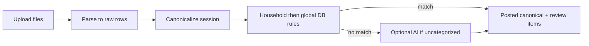
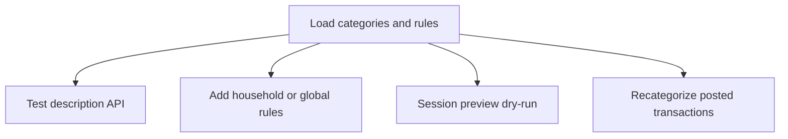

# Categorization roadmap (beyond keyword rules)

This complements [`IMPORT_CLASSIFICATION.md`](IMPORT_CLASSIFICATION.md), which describes **what the code does today**. Here we summarize **limits of that approach** and a **practical improvement path** that stays compatible with **self-hosted / air-gapped** deployments (no cloud dependency as a default).

---

## Default category taxonomy (parents and children)

Source of truth: [`backend/db/seeds/0001_seed_defaults.sql`](../backend/db/seeds/0001_seed_defaults.sql), [`backend/db/migrations/0008_income_taxes_transfers_taxonomy.sql`](../backend/db/migrations/0008_income_taxes_transfers_taxonomy.sql), [`backend/db/migrations/0025_category_insurance_taxonomy.sql`](../backend/db/migrations/0025_category_insurance_taxonomy.sql), and [`backend/db/migrations/0027_taxonomy_refresh.sql`](../backend/db/migrations/0027_taxonomy_refresh.sql). Rules assign **leaf** categories only (see `classifyWithRules` in `backend/src/modules/category/category-rules.ts`).

**Top-level buckets**

| ID suffix | Name | Notes |
|-----------|------|--------|
| `...001` | **Income** | Parent (Salary, Interest, … — see migration 0008) |
| `...101` | **Shopping** | Parent |
| `...102` | **Home** | Parent |
| `...103` | **Mobility** | Parent |
| `...104` | **Borrowing** | Parent |
| `...105` | **Investments** | Parent |
| `...106` | **Healthcare** | Parent |
| `...107` | **Food** | Parent |
| `...108` | **Insurance** | Parent |
| `...109` | **Education** | Parent |
| `...110` | **Giving** | Parent |
| `...111` | **Taxes** | Parent (migration 0008; leaves expanded in 0027) |
| `...112` | **Transfers** | Parent (migration 0008) |
| `...117` | **Utilities** | Parent (split from former combined Home bucket, migration 0027) |

**Children by parent**

- **Shopping** → Groceries (`...004`), Clothing (`...008`)
- **Home** → Housing (`...002`), Furniture (`...034`), Maintenance and repairs (`...035`), Home improvement (`...036`)
- **Utilities** → Energy (`...118`), Water trash and sewage (`...119`), Mobile phone (`...120`)
- **Mobility** → Transit and fuel (`...005`), Auto maintenance (`...129`)
- **Borrowing** → Credit card payments (`...006`), Loan payments (`...121`), Personal lending (`...122`)
- **Investments** → Stocks (`...009`), 529 plan (`...126`), Real estate (`...127`), Crypto (`...128`)
- **Healthcare** → Medical (`...020`), Pharmacy (`...021`), Fitness (`...022`), Wellness (`...125`)
- **Food** → Dining out (`...023`), Coffee (`...024`), Snacks (`...124`)
- **Insurance** → **Home insurance** (`...025`), **Auto insurance** (`...026`), Health insurance (`...031`), Life insurance (`...032`), Other insurance (`...033`)
- **Education** → Tuition (`...027`), Childcare (`...028`), Activities and camps (`...123`)
- **Giving** → Charity (`...029`), Gifts (`...030`)
- **Income** (0008) → Salary (`...007`), Interest (`...011`), Dividends (`...012`), Refunds (`...013`), Rental income (`...010`)
- **Taxes** (0008 + 0027) → Federal income tax (`...113`), State income tax (`...130`), Sales tax (`...114`), Federal tax refund (`...131`), State tax refund (`...132`)
- **Transfers** (0008) → Transfers in (`...115`), Transfers out (`...116`)

**Insurance (explicit):** The parent **Insurance** includes **home** and **auto** as first-class leaves (`Home insurance`, `Auto insurance`), plus Health, Life, and Other insurance added in migration 0025.

---

## End-to-end product flow

### A. Import (statement → ledger)

1. **Create or open an import session** — User goes to the import workspace, starts a session, and uploads files.
2. **Per-file setup** — For each file: bind a **financial account**, choose **parser profile** (and payslip-specific options where applicable), and **belongs-to** scope if your app supports household vs. person.
3. **Parse** — Backend reads raw rows into `transaction_raw` with extracted JSON payloads (dates, amounts, descriptions).
4. **Canonicalize** — User triggers canonicalization for the session. For each raw row the backend:
   - Skips **exact duplicate** fingerprints (same household, account, date, amount, normalized description as an existing posted row).
   - Queues **near-duplicate** and **transfer** handling separately (resolution items, not only “unknown category”).
   - **Classifies** each row: `classifyWithRules(normalizedDescription, amount, dbRules)`:
     1. **Household `category_rule` rows** (from Category Rules UI), priority order, first match wins on normalized text.
     2. **`category_rule_global`** rows (built-in defaults, table from migration `0026_category_rule_global.sql`, default rows from seed `0002_seed_category_rule_global.sql`), merged after household rules.
     3. If still **no category**, the row is queued for **optional AI** (if enabled): batched OpenAI suggestions; high-confidence suggestions can auto-apply per `AI_CATEGORY_*` env thresholds.
   - Inserts **`transaction_canonical`** with `category_id` (possibly null) and classification metadata JSON.
   - If `category_id` is still null, creates an **`unknown_category`** resolution item so the user can fix it from review / ledger.
5. **After import** — User may open **Transactions**, filter **Needs review**, assign categories, and (from the UI) **create a household rule from a ledger row** so future imports match without re-labeling.

### B. Category Rules page (`/categories/rules`)

1. **Load** — Fetches **`GET /categories`** (tree) and **`GET /categories/rules`** (**built-in** rows from `category_rule_global` + **household** rows from `category_rule`).
2. **Browse / filter** — User filters the combined list to find patterns or categories.
3. **Test description** — User enters a sample description (and amount); **`POST /categories/rules/test`** returns what would match (household rules, then globals), without saving.
4. **Add or edit rules** — User saves **household** rules (pattern, match type, category, priority, confidence). Owners/admins can add or edit **global** built-in rules via **`POST` / `PATCH` / `DELETE` `/categories/rules/builtin`**. Multiple household patterns in one form create multiple rows.
5. **Statement preview (rule learning)** — User pastes an **import session id** after a parse; UI calls **`POST /categories/rules/rule-learning-preview`** to show how current rules would classify each raw row in that session (dry-run for tuning rules before or after canonicalize).
6. **Re-apply to ledger** — User runs **`POST /categories/rules/recategorize`** (all posted rows or uncategorized-only) so existing `transaction_canonical` rows get updated from DB + built-in rules without re-importing.

### C. How this ties together

- **Import** applies rules **at canonicalize time**; improving rules improves **the next** canonicalize (and AI only fills gaps when configured).
- **Category Rules** is the place to **add memory** (household patterns), **test** matches, **preview** a parsed session, and **backfill** the ledger via recategorize.

---

## Current behavior (short)

- **Global defaults:** Rows in **`category_rule_global`** (plus household **`category_rule`**) drive matching via **`classifyWithRules`** on **fingerprint-normalized** text (`contains` / `prefix` / `regex`).
- **DB rules** (`/categories/rules`): match modes include `contains`, `prefix`, and `regex` — only those rows are “regex-capable.”
- **“Needs review”** is **not** only “unknown category.” It aggregates uncategorized rows, non-posted items, **near-duplicate**, **transfer ambiguity**, **reconciliation mismatch**, and similar (`NEEDS_REVIEW_PREDICATE` in `backend/src/modules/ledger/ledger.service.ts`). When many rows sit in review, **break down by resolution type** before attributing the mix to classification alone.

## Limits of keyword-only defaults

- New merchants and wording variants miss until a rule exists.
- Typos and bank-specific suffix noise are brittle without fuzzy matching.
- Regex in DB rules is powerful but **manual** and easy to overfit without tests.

## Suggested tiers (air-gap friendly)

| Tier | Idea | Notes |
|------|------|--------|
| **A — User / household memory** | After a user assigns a category to a **normalized merchant** (or fingerprint), persist and reuse on future imports (e.g. SQLite keyed by household + normalized key). | High ROI, no ML, strong privacy. |
| **B — Fuzzy string similarity** | Match normalized description to known labels or past assignments (e.g. RapidFuzz in Python pipelines, or a TS equivalent for in-app logic). | Helps typos and noisy suffixes; complements keywords. |
| **C — Lightweight ML (optional)** | Offline training: TF–IDF + simple classifier on user-labeled rows, or a small local model. | Heavier: data volume, maintenance, reproducibility. |
| **D — External / cloud LLM** | Only where policy allows. | Conflicts with strict air-gap unless **local** inference (e.g. Ollama). Not a default. |

## Non-goals (for this product direction)

- **No requirement** for cloud APIs or third-party categorization services.
- **No** mandatory ML stack for core import flows; tiers B–D are optional phases.

## Related docs

- [`IMPORT_CLASSIFICATION.md`](IMPORT_CLASSIFICATION.md) — ingest order, dedupe, transfers, rules
- [`ARCHITECTURE.md`](ARCHITECTURE.md) — broader system context
