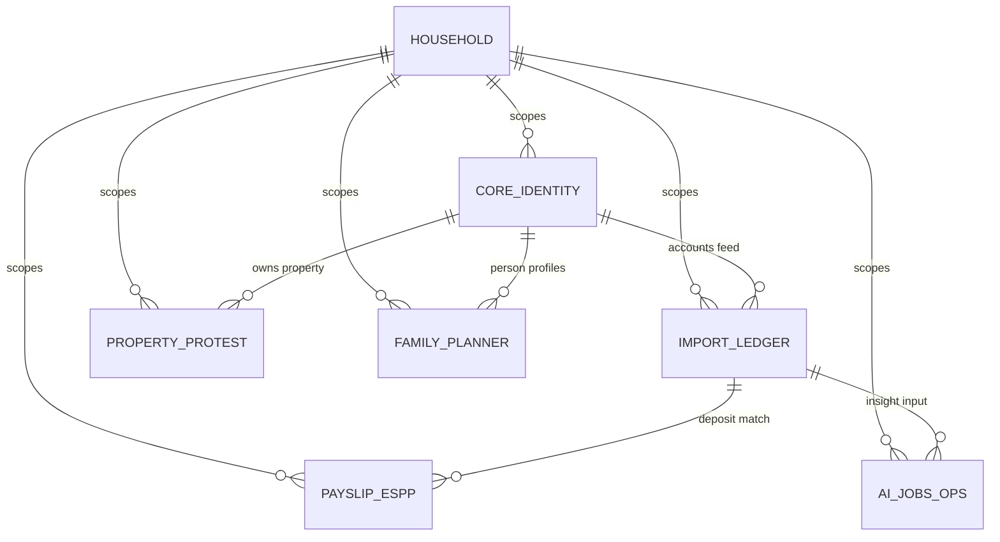
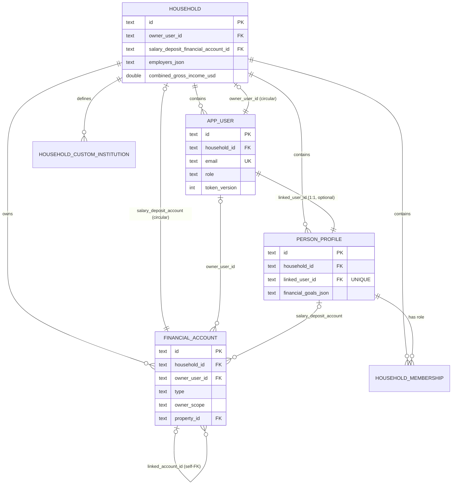
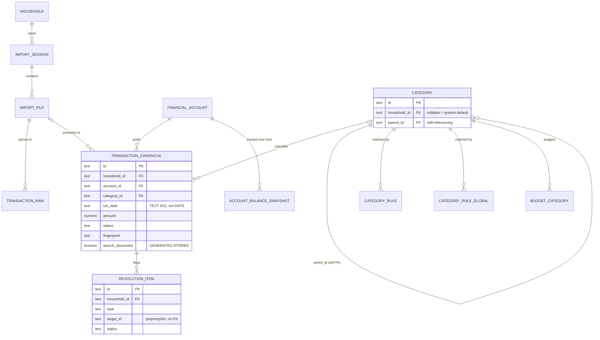
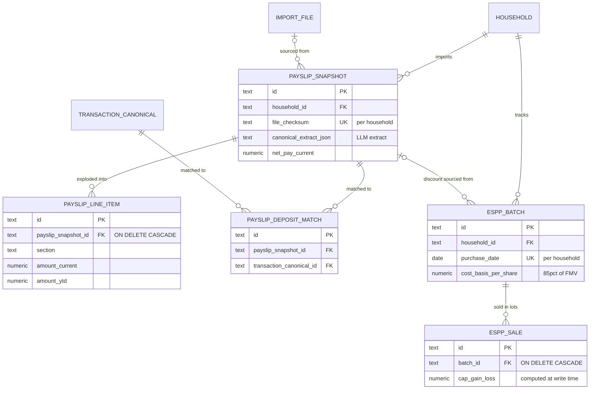
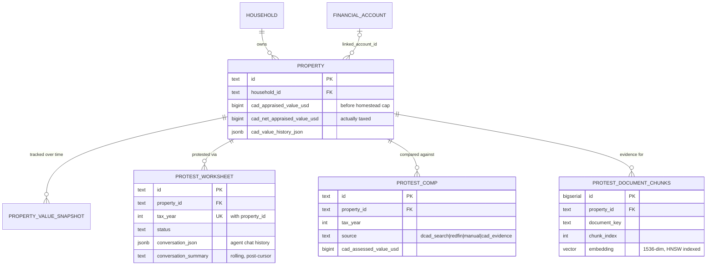
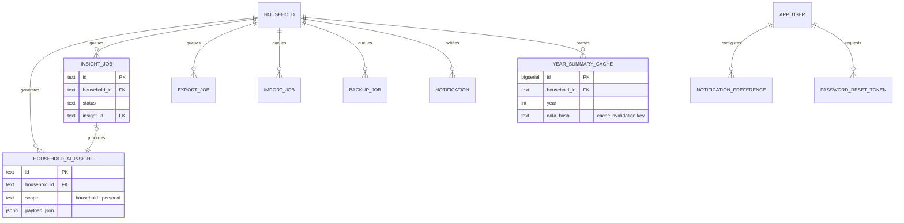

# Database Architecture

Schema catalog, entity-relationship diagrams, index/constraint rationale, and Postgres-specific
design decisions for the Household Finance App. This is the canonical reference for the data
model — for deploy/ops/env-var content see `ADMIN_GUIDE.md` §5; for the *why* behind major
architecture decisions see `PRD_AND_CRS.md` "Database Architecture Decisions".

**Keep this current**: any migration that adds, drops, or alters a table must update the
relevant section here in the same commit (see `CLAUDE.md` checklist).

---

## 1. Overview

- **Engine**: Postgres 18. Docker locally (`docker compose up -d`, port 5433), managed Postgres
  on Koyeb in production.
- **Tenancy model**: single schema, multi-tenant by column. Every table hangs off `household(id)`
  either directly (`household_id` FK) or transitively. There is no schema-per-tenant and no
  Postgres Row-Level Security — isolation is enforced at the application query layer, where every
  service-layer query filters by `household_id` (see §5, "No RLS").
- **Scale**: 45 physical tables — 44 created via SQL migration files, plus `schema_migrations`
  (created programmatically by the migration runner itself, not a `.sql` file). Grouped below into
  9 functional domains.
- **Migration strategy**: `backend/db/migrations/` holds `0001_baseline.sql` (a squashed snapshot
  of migrations 0001–0039) followed by incremental, feature-scoped files (`0041`...`0089`,
  numbering not contiguous — some numbers were retired as dead/no-op and folded into the
  baseline). The migration runner (`backend/src/db/apply-pg-migrations.ts`) applies any file not
  yet recorded in `schema_migrations`, tracked by filename, on backend startup. See §7 for why the
  baseline was squashed and the convention for adding new migrations.
- **Backup/restore**: a curated subset of tables round-trips through `.hfb` export/restore
  bundles; operational/job-log/credential tables are deliberately excluded. See §8.

---

## 2. Domain relationship overview

All nine domains ultimately scope to `household`. Arrows show the primary FK direction (child →
parent).

Domains, table counts, and their role:

| Domain | Tables | Role |
|---|---|---|
| Core/Identity | 6 | Household, users, people, accounts — the tenancy root |
| Import & Ledger | 11 | CSV/OFX import pipeline, categorization, the transaction ledger |
| Payslip & ESPP | 5 | Payslip PDF extraction, deposit matching, employee stock purchase tracking |
| Property & Tax Protest | 5 | Real estate value tracking, DCAD property-tax protest workflow, RAG document store |
| Family Planner | 8 | Calendar sync, AI agent alerts/digests, household help scheduling, agent memory |
| AI Insights & Jobs/Ops | 10 | Async job queues, AI-generated insights, notifications, auth tokens |

---

## 3. Domain-grouped ERDs

### 3.1 Core / Identity

**Circular-FK bootstrap**: `household` and `app_user` reference each other (household needs an
`owner_user_id`; every user needs a `household_id`), as does `household` ↔ `financial_account`
(salary-deposit account). Postgres can't satisfy two mutually-referencing `NOT NULL` FKs at
`CREATE TABLE` time, so the baseline migration creates both tables with the *forward* reference
only, then wires the back-reference with a separate `ALTER TABLE ... ADD CONSTRAINT` once both
tables exist (`0001_baseline.sql` lines 15–70).

### 3.2 Import & Ledger

Note: `category_id` on `transaction_canonical` is nullable and **must be `LEFT JOIN`ed, never
`INNER JOIN`ed** — after a `.hfb` restore, transactions can reference a custom category that no
longer exists (custom categories aren't restored the same way). `txn_date` is `TEXT` (ISO
`YYYY-MM-DD`), not `DATE` — a deliberate legacy choice from the app's original SQLite schema,
retained because date-range filtering as string comparison works correctly for ISO-formatted
dates and avoids a data migration. Contrast with `account_balance_snapshot.as_of_date`, which
*is* a real `DATE` column (added later, done "right" from the start).

### 3.3 Payslip & ESPP

### 3.4 Property & Tax Protest

`protest_comp` (0068) replaced an earlier `protest_comp_cad` table — a real example of schema
evolution: the original table only handled one comp source (DCAD search results); `protest_comp`
unifies four sourcing paths (DCAD search, Redfin sold comps, manual entry, parsed CAD evidence
PDFs) into one table with a `source` discriminator column, and the old table was dropped in the
same migration once the data model settled (`DROP TABLE IF EXISTS protest_comp_cad`).

### 3.5 Family Planner

```mermaid
erDiagram
    HOUSEHOLD ||--o{ FAMILY_EVENTS : schedules
    HOUSEHOLD ||--o{ FAMILY_AGENT_ALERTS : generates
    HOUSEHOLD ||--o{ FAMILY_DIGEST_LOG : logs
    HOUSEHOLD ||--o{ HOUSEHOLD_HELP_AVAILABILITY : rosters
    PERSON_PROFILE ||--o{ HOUSEHOLD_HELP_AVAILABILITY : "available for"
    HOUSEHOLD ||--o{ HOUSEHOLD_PA_PREFERENCES : remembers
    HOUSEHOLD ||--o{ PA_TASK_RUN : runs
    HOUSEHOLD ||--o{ EMAIL_INGEST_LOG : ingests
    HOUSEHOLD ||--o{ OAUTH_INTEGRATIONS : connects
    APP_USER |o--o{ OAUTH_INTEGRATIONS : "user-scoped (Calendar)"

    FAMILY_EVENTS {
        text id PK
        text household_id FK
        text record_type "event | deadline"
        text source "gcal | tavily | manual"
        text gcal_event_id
    }
    FAMILY_AGENT_ALERTS {
        text id PK
        text household_id FK
        text alert_type
        text digest_priority
        jsonb action_payload "GCal write-back"
    }
    OAUTH_INTEGRATIONS {
        text id PK
        text household_id FK
        text user_id FK "NULL = household-scoped (Drive)"
        text provider "google_drive | google_calendar"
        text calendar_roles "JSON: calendarId -> role"
    }
    HOUSEHOLD_PA_PREFERENCES {
        serial id PK
        text household_id FK
        text category "preference|discovered_fact|decision_history|settings"
        text topic_tag
        text fact_text "e.g. 'true'/'false' for category='settings' rows"
    }
```

The Occasion Nudges on/off toggle (Settings → Family) is stored as a `household_pa_preferences`
row (`category = 'settings'`, `topic_tag = 'occasion_nudges'`, `fact_text = 'true'|'false'`)
rather than a dedicated table — folded from a single-boolean `family_occasion_settings` table via
migration `0089_fold_family_occasion_settings.sql` (DEBT #259).

`oauth_integrations` is a deliberately unified table for two different OAuth relationships: Google
Drive is one connection *per household* (`user_id IS NULL`, enforced by a partial unique index),
Google Calendar is one connection *per parent* (`user_id IS NOT NULL`, enforced by a second
partial unique index on the same table). It replaced an earlier single-purpose
`household_gdrive_config` table (dropped in `0069_oauth_integrations.sql`) once Calendar
integration needed the same OAuth-token-lifecycle machinery. The household inbox (email ingest,
`email_ingest_log`) deliberately does **not** go through `oauth_integrations` — it's a shared
mailbox polled over IMAP with an app password, not a per-parent OAuth grant; see
`household_credential_separation` rationale in §5.

### 3.6 AI Insights & Jobs/Ops

All five job-queue tables (`import_job`, `export_job`, `insight_job`, `backup_job`, plus
`pa_task_run` in the Family Planner domain) follow the same shape: `status` enum, `created_at`/
`completed_at`, an error-text column, and a `household_id, created_at DESC` index for the jobs
list UI. None of them are in the backup registry (see §8) — job history is operational, not user
data.

---

## 4. Full table catalog

### Core / Identity (6)

| Table | Purpose | Key columns | Notable constraints/indexes |
|---|---|---|---|
| `household` | Tenancy root | `owner_user_id`, `salary_deposit_financial_account_id` (both circular FKs) | — |
| `app_user` | Login/auth | `email` UNIQUE, `role` CHECK, `token_version` | `token_version` bumped on `.hfb` restore to invalidate live sessions |
| `person_profile` | Every household member, incl. non-login (kids, nanny) | `linked_user_id` FK UNIQUE (1:1, optional), AI-health fields (`age`, `risk_tolerance`...) | `date_of_birth_encrypted` stripped on export (app-layer encryption, instance-bound key) |
| `household_membership` | Person ↔ household role/relationship | `role`, `relationship` CHECK | `UNIQUE(household_id, person_profile_id)` |
| `financial_account` | Bank/brokerage/loan/property-linked accounts | `type` CHECK (8 values), `owner_scope`, `linked_account_id` self-FK, `property_id` FK | `idx_financial_account_household` |
| `household_custom_institution` | User-defined bank names beyond the built-in adapter list | `display_name` | `UNIQUE(household_id, lower(display_name))` — case-insensitive functional index |

### Import & Ledger (11)

| Table | Purpose | Key columns | Notable constraints/indexes |
|---|---|---|---|
| `import_session` | One row per upload/watch-folder batch | `source_type`, `status`, `stats_json` JSONB | `idx_import_session_household_started` |
| `import_file` | One row per file within a session | `checksum`, `status`, `payslip_async_provider` | `UNIQUE(session_id, checksum)` dedup |
| `transaction_raw` | Pre-classification raw parsed rows | `extracted_payload_json`, `confidence` | `idx_transaction_raw_file_id` |
| `category` | Hierarchical category taxonomy | `parent_id` self-FK, `household_id` nullable (NULL = system default) | — |
| `category_rule` | Household auto-categorization rules | `pattern`, `match_type`, `confidence`, `priority` | `idx_category_rule_household_priority` |
| `category_rule_global` | Seed/system-wide rules | `rule_key` UNIQUE | Ephemeral — reseeded, not backed up |
| `transaction_canonical` | **The ledger.** Central fact table | `txn_date` TEXT ISO, `fingerprint`, `status`, `search_document` GENERATED tsvector | 2 partial unique indexes (fingerprint dedup; OFX FITID dedup) + GIN FTS index + 4 compound perf indexes |
| `resolution_item` | Human-in-the-loop review queue | `type` CHECK (4 values), `target_id` polymorphic (no FK) | `idx_ri_household_status_type`, `idx_ri_household_target` |
| `account_balance_snapshot` | Point-in-time account balances | `as_of_date` **real DATE**, `source` CHECK(manual/import) | 2 partial unique indexes — one per source, so manual and import balances can coexist same-day |
| `budget_category` | Monthly budget target per category | `month` CHECK regex `YYYY-MM`, `amount` CHECK `>= 0` | `UNIQUE(household_id, category_id, month)` |
| `recurring_merchant_override` | User confirm/dismiss verdict for detected recurring merchants | `verdict` CHECK, `amount_tolerance_pct` | `UNIQUE(household_id, merchant_key)` |

### Payslip & ESPP (5)

| Table | Purpose | Key columns | Notable constraints/indexes |
|---|---|---|---|
| `payslip_snapshot` | One row per parsed payslip PDF | ~15 current/YTD NUMERIC pay figures, `canonical_extract_json` (validated LLM extract) | `UNIQUE(household_id, file_checksum)` dedup |
| `payslip_line_item` | Normalized line items exploded from a snapshot | `section` CHECK (7 values), `sort_order` (preserves PDF row order) | FK `ON DELETE CASCADE` from `payslip_snapshot` |
| `payslip_deposit_match` | Confirmed payslip ↔ bank-deposit link | join table, 1 payslip : N deposits | `UNIQUE(payslip_snapshot_id, transaction_canonical_id)`, both FKs `ON DELETE CASCADE` |
| `espp_batch` | One row per ESPP purchase date | `cost_basis_per_share` (85% of FMV — plan design constant), `payslip_id` FK `SET NULL` | `UNIQUE(household_id, purchase_date)` |
| `espp_sale` | One row per lot disposal (time series) | `cap_gain_loss` computed at write time from batch cost basis | FK `ON DELETE CASCADE` from `espp_batch` |

### Property & Tax Protest (5)

| Table | Purpose | Key columns | Notable constraints/indexes |
|---|---|---|---|
| `property` | Real estate owned by household | 7 DCAD assessed-value columns (`cad_land_value_usd`...`cad_net_appraised_value_usd`), `cad_value_history_json`/`cad_taxable_json` JSONB | — |
| `property_value_snapshot` | Time-series market value | `as_of_date` DATE, `source` CHECK(manual/api) | `UNIQUE(property_id, as_of_date)` |
| `protest_worksheet` | One row per property per tax year protested | `status` CHECK (5 values), `conversation_json` JSONB (agent chat history), `summarization_cursor`/`conversation_summary`/`cycle_summary` (rolling-summary pattern) | `UNIQUE(property_id, tax_year)` |
| `protest_comp` | Unified comparable-properties table (replaced `protest_comp_cad`, see §3.4) | `source` CHECK (4 values: dcad_search/redfin/manual/cad_evidence) | 2 partial unique indexes split on whether `cad_property_id IS NOT NULL` |
| `protest_document_chunks` | pgvector RAG store for uploaded CAD evidence PDFs | `embedding vector(1536)`, `document_key`, `chunk_index` | HNSW index (`vector_cosine_ops`), `UNIQUE(property_id, tax_year, document_key, chunk_index)` |

### Family Planner (8)

| Table | Purpose | Key columns | Notable constraints/indexes |
|---|---|---|---|
| `family_events` | Unified events + deadlines table | `record_type` CHECK(event/deadline), `source` CHECK(gcal/tavily/manual), soft-delete `is_active` | Partial index `WHERE is_active = TRUE` |
| `family_agent_alerts` | Agent-detected conflicts (Owner reviews in Agent tab) | `alert_type`, `digest_priority`, `action_payload` JSONB (GCal write-back), `copy_paste_text` | `family_agent_alerts_household` |
| `family_digest_log` | One row per agent digest run | `run_type` CHECK (4 values), `status` CHECK(sent/skipped/error) | `family_digest_log_household` |
| `household_help_availability` | Unified schedule roster for nanny/babysitter/cleaner/tutor/etc. | `slot_type` × `service_type` (orthogonal dimensions), `day_of_week` or `specific_date` | 3 indexes incl. `(household_id, is_active, slot_type)` |
| `pa_task_run` | Agent task-loop run history (BabyAGI-style loop) | `iterations_used`, `findings_json`, `estimated_cost_usd`, `capture_mode` | Ephemeral — operational, not user data |
| `household_pa_preferences` | Agent long-term memory store, plus per-household settings (e.g. Occasion Nudges toggle) | `category` CHECK(preference/discovered_fact/decision_history/settings), `topic_tag` (bounded enum, widened three times — see `0085`/`0086`/`0089`), `fact_text` | `(household_id, category, topic_tag)` index; partial unique `household_pa_preferences_settings_unique ON (household_id, topic_tag) WHERE category = 'settings'` |
| `email_ingest_log` | Household inbox ingestion (shared mailbox, IMAP + app password) | `message_id`, `items_json` JSONB, `status` CHECK (4 values) | `UNIQUE(household_id, message_id)` |
| `oauth_integrations` | Unified Google OAuth store — Drive (household-scoped) + Calendar (user-scoped) | `provider` CHECK, `calendar_roles`, `selected_calendar_ids`, `gcal_last_synced_at` | 2 partial unique indexes (see §3.5); ephemeral — credentials never appear in `.hfb` backups |

### AI Insights & Jobs/Ops (10)

| Table | Purpose | Key columns | Notable constraints/indexes |
|---|---|---|---|
| `household_ai_insight` | Generated AI insight payloads | `scope` CHECK(household/personal), `payload_json` **JSONB** (native, not legacy TEXT) | `idx_household_ai_insight_lookup` |
| `insight_job` | Async queue for insight generation | `status`, `insight_id` FK `SET NULL` | — |
| `export_job` | `.hfb` export job queue | `storage_path`, `person_profile_id` FK (member-scoped exports) | — |
| `import_job` | `.hfb` restore job queue | `stats_json` | — |
| `backup_job` | Google Drive scheduled backup job queue | `drive_file_id`, `size_bytes` | — |
| `notification` | In-app notification | `read_at`, `action_url` | `(household_id, user_id, read_at, created_at DESC)` |
| `notification_preference` | Per-user notification channel toggles | `enabled_email`, `enabled_inapp` | `UNIQUE(user_id, notification_type)` |
| `year_summary_cache` | Cached "Year in Review" computation + LLM narrative | `data_hash` (cache invalidation key) | `UNIQUE(household_id, year)` |
| `password_reset_token` | Auth reset tokens | `token_hash`, `expires_at`, `used_at` | `idx_prt_user` |
| `schema_migrations` | Migration tracking (created by the runner, not a `.sql` file) | filename, applied timestamp | — |

---

## 5. Postgres feature showcase

| Feature | Where | Why it's here |
|---|---|---|
| **pgvector + HNSW index** | `protest_document_chunks.embedding` (`0064_pt12_document_chunks.sql`) | Semantic search over chunked, embedded PDF text (CAD evidence documents) for the tax-protest RAG agent. `CREATE EXTENSION vector` — works unmodified on Koyeb managed Postgres and Neon. HNSW chosen over IVFFlat for build-time simplicity at this table's scale; falls back to exact scan if the index is missing. |
| **Generated column + GIN full-text index** | `transaction_canonical.search_document tsvector GENERATED ALWAYS AS (...) STORED` | Merchant/memo search without maintaining a separate sync trigger — Postgres recomputes the tsvector on every write, `GIN` index makes it fast. |
| **Partial unique indexes** (×5 across the schema) | Ledger fingerprint dedup (excludes `duplicate`/`trashed` rows), OFX/QFX FITID dedup per account (excludes `NULL`), manual-vs-import balance snapshots coexisting per account/date, DCAD-identified vs non-identified protest comps | Each encodes a business rule as a constraint instead of application-layer locking — the two "duplicate detection" indexes in particular let intentionally-duplicate rows exist without violating uniqueness, because the partial `WHERE` clause excludes them. |
| **Circular FK bootstrap** | `household` ↔ `app_user`, `household` ↔ `financial_account` | Two tables that mutually require each other's ID at the schema level; solved by omitting the back-reference at `CREATE TABLE` time and wiring it with `ALTER TABLE ... ADD CONSTRAINT` once both tables exist. See §3.1. |
| **JSONB vs. legacy TEXT-JSON** | JSONB: `household_ai_insight.payload_json`, `protest_worksheet.conversation_json`, `family_agent_alerts.action_payload`, `email_ingest_log.items_json`. TEXT-JSON: `import_session.confidence_summary`... wait, actually `stats_json` is JSONB; older columns like `payslip_snapshot.raw_extract_json` are TEXT | Newer tables (AI insights, agent conversation state, ESPP/protest features) default to JSONB for queryability; a handful of older columns are plain `TEXT` holding serialized JSON — inherited from the app's original SQLite schema (no JSONB there) and never backfilled since nothing queries into them. |
| **CHECK-constraint enums, not native `ENUM` type** | Every status/type/role column in the schema (`status`, `role`, `direction`, `source`...) | Postgres native `ENUM` requires `ALTER TYPE ... ADD VALUE` (can't run in a transaction pre-PG12, and still awkward to remove a value); `CHECK (col IN (...))` is a plain `DROP CONSTRAINT` / `ADD CONSTRAINT` pair, which is how every enum-widening migration in this schema does it (e.g. `0085`→`0086` widening `topic_tag`). |
| **Compound indexes matched to real query shapes** | `idx_tc_household_date_status`, `idx_tc_household_account_date`, `idx_tc_transfer_group` on `transaction_canonical` | Built for the ledger list view (household + date range + status filter), the cash-summary report, and transfer-pair detection — not generic "index everything" columns. |
| **No Row-Level Security** | Tenancy isolation is 100% application-layer: every service function filters by `household_id` explicitly | A deliberate tradeoff, not an oversight — RLS would add defense-in-depth against a query missing its `household_id` filter, at the cost of policy maintenance across 40+ tables and a second place tenancy logic must stay in sync. Worth naming directly if asked: this is the natural next hardening step for a single-tenant-per-row schema like this one. |
| **`gen_random_uuid()` for PKs on newer tables** | e.g. `recurring_merchant_override`, `household_ai_insight`, `family_events`, `oauth_integrations` | Built into Postgres 13+, no `pgcrypto` extension needed (baseline migration explicitly notes this). Older tables use app-generated string IDs instead — inconsistent by history, not by current convention. |

---

## 6. Index & constraint strategy (by purpose)

- **Deduplication**: partial unique indexes are the workhorse — `transaction_canonical` fingerprint
  dedup, OFX FITID dedup, `import_file` checksum-per-session, `payslip_snapshot`
  checksum-per-household. Each encodes "this can't be re-imported" as a database constraint so the
  application doesn't need a read-then-write race-prone check.
- **Full-text search**: single GIN index on the generated `search_document` tsvector column
  (`transaction_canonical`) — merchant/memo search across the whole ledger.
- **Time-series / report queries**: compound indexes leading with `household_id` then a `DESC`
  timestamp/date column are the repeated pattern — `import_session`, `export_job`, `import_job`,
  `payslip_snapshot`, `espp_batch`, `pa_task_run`, `family_digest_log` all follow it. This matches
  the near-universal query shape: "this household's rows, most recent first."
  **`account_balance_snapshot`/`property_value_snapshot`** invert to `(entity_id, date DESC)`
  since those are queried per-account/per-property, not per-household list views.
- **Cascade-delete rules**: `ON DELETE CASCADE` is used for true ownership/composition —
  `payslip_line_item` cascades from `payslip_snapshot`, `espp_sale` cascades from `espp_batch`,
  every Family Planner/Property/Protest child table cascades from `household`. `ON DELETE SET
  NULL` is used for optional cross-references that shouldn't take the referencing row down with
  them — `financial_account.property_id`, `person_profile.salary_deposit_financial_account_id`,
  `resolution_item.assigned_to`.
- **Soft-delete filtering**: `family_events` uses a partial index `WHERE is_active = TRUE` rather
  than a hard delete, since GCal-sourced events need to preserve `gcal_event_id` for future
  delta-sync dedup even after removal from the UI.

---

## 7. Migration strategy

`backend/db/migrations/0001_baseline.sql` is a **squashed snapshot** — migrations 0001 through
0039 were merged into one file once the schema stabilized, with the original per-feature files
moved to `backend/db/migrations/archive/`. The baseline file documents exactly what was dropped
in the squash and why (dead columns with zero code references, seed-data inserts already covered
by the bootstrap seed file, a no-op column drop). Fresh installs apply the baseline + every
incremental file after it; existing databases already have `0001_baseline.sql` recorded in
`schema_migrations` by filename, so the runner skips it and applies only files it hasn't seen.

Convention for new migrations: one file per feature/change, numbered sequentially
(`NNNN_<feature_slug>.sql`), applied automatically on backend startup by
`backend/src/db/apply-pg-migrations.ts`. Never edit a migration that's already shipped — add a new
one, even to fix a mistake in an old one.

---

## 8. Backup & export coverage

Every table falls into exactly one of two buckets in
`backend/src/modules/export/export-registry.ts` — a table that isn't in either is silently
excluded from `.hfb` backups (there's a `[export-coverage]` startup warning that catches this).

- **`EXPORT_REGISTRY`** (30 tables) — user data, restored in `restoreOrder` to satisfy FK
  dependencies (e.g. `property` before `financial_account`, since `financial_account.property_id`
  references it). Some entries carry an `onExport`/`onRestore` transform — `person_profile` strips
  the encrypted DOB column on export (instance-bound encryption key won't match on restore),
  `household` nulls out its circular-FK columns and is restored with `skipInsert` (the row already
  exists from account creation), `app_user.token_version` is bumped on restore to force
  re-authentication.
- **`EXPORT_EPHEMERAL_TABLES`** (15 tables) — explicitly *not* backed up: import/export/insight/
  backup job logs (operational history), `transaction_raw`/`import_session`/`import_file` (staging
  data superseded once promoted to `transaction_canonical`), `oauth_integrations` (credentials —
  users re-connect after restore rather than have tokens round-trip through a backup file),
  `notification`/`notification_preference` (transient UI state), `category_rule_global` (reseeded,
  not household data), `protest_document_chunks` (regenerable from source PDFs), `pa_task_run`
  (agent run log), `password_reset_token`, `schema_migrations`.

---

## 9. Interview talking points

- **Multi-tenant via column scoping, not schema-per-tenant or RLS** — a deliberate simplicity
  tradeoff for a self-hosted single-deployment app; can name RLS as the natural hardening step.
- **pgvector + HNSW for RAG**, running on managed Postgres (Koyeb/Neon) with zero extra
  infrastructure — no separate vector database.
- **Generated `tsvector` column + GIN index** for full-text search — computed by Postgres on
  write, not maintained by application code or a trigger.
- **Partial unique indexes as business-rule enforcement** — five separate uses across the schema,
  each turning a "don't double-import" or "these can coexist, those can't" rule into a constraint
  instead of a race-prone application check.
- **Circular FK bootstrap** — a real example of working around a Postgres DDL ordering constraint
  cleanly (deferred `ALTER TABLE ADD CONSTRAINT`) rather than denormalizing the schema to avoid it.
- **Migration squashing with a documented paper trail** — the baseline migration's header comment
  is itself a mini changelog of what was intentionally dropped and why, not just "current state."
